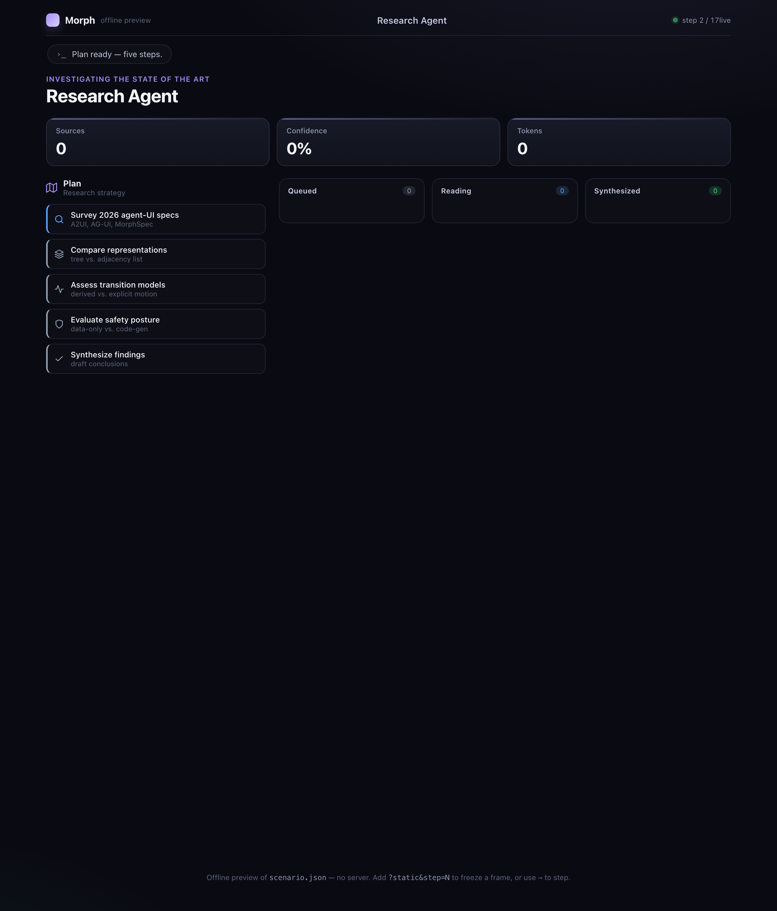
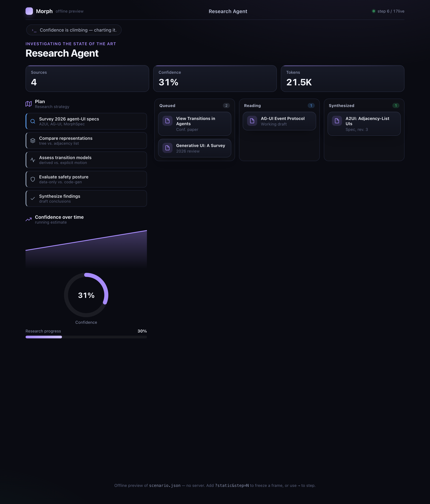
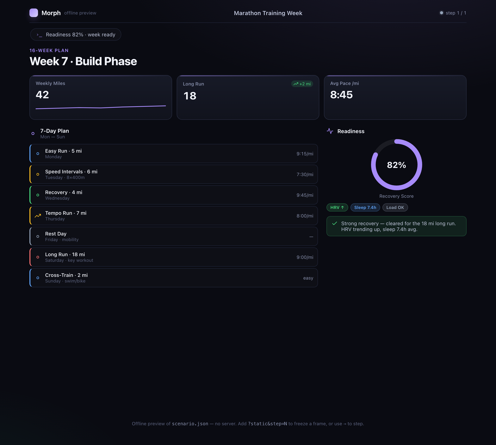
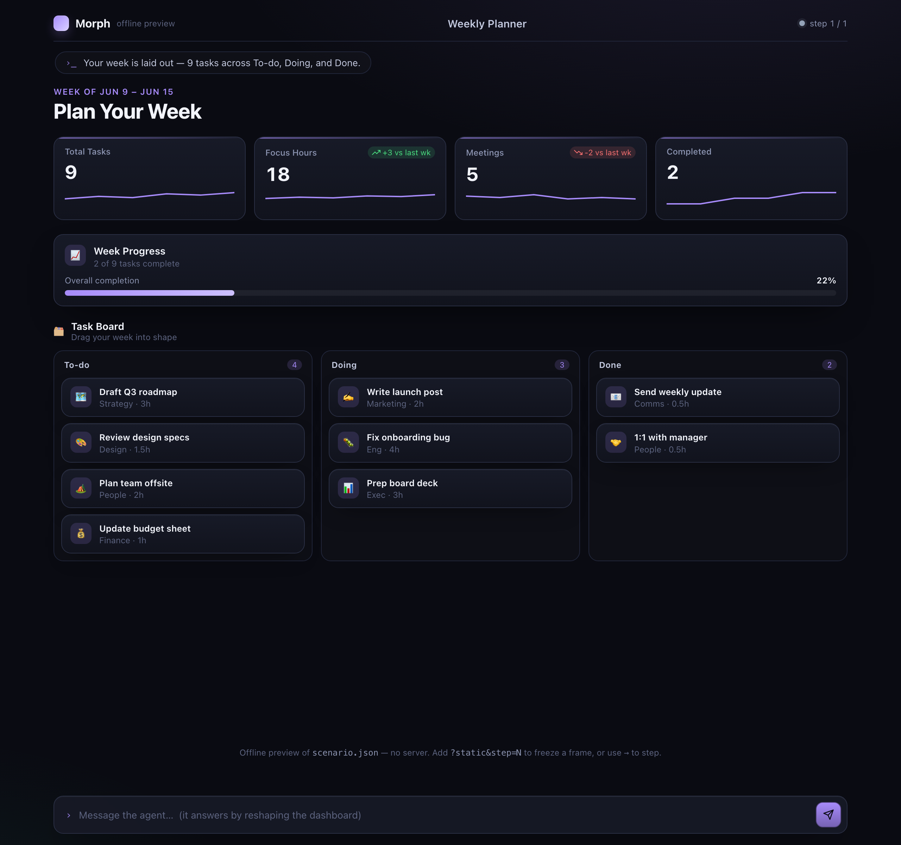
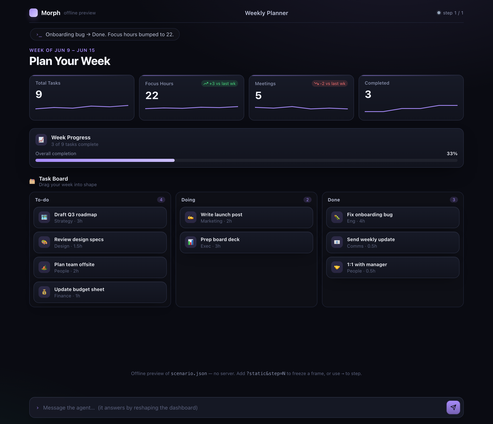

# Morph

**An agent that talks by reshaping a living dashboard — not by typing at you.**

Morph is a declarative agent-UI runtime. Instead of streaming paragraphs into a
chat transcript, the agent streams small JSON messages that mutate a flat,
stable-ID component model. Because element identity survives every mutation, the
browser's [View Transitions API](https://developer.mozilla.org/en-US/docs/Web/API/View_Transitions_API)
animates each diff *for free* — counters tick up, cards fly between columns,
spinners morph into result panels — and the agent's "voice" shrinks to a thin
status ticker. The dashboard, not the prose, is the message.

| Scripted scenario | | Live Claude agent |
|:--:|:--:|:--:|
|  |  |  |
| *a research agent boots its dashboard…* | *…cards fly between columns as it works…* | *a live agent, given only a goal, designs its own dashboard* |

> The first two frames are the canned `scenario.json`; the third was generated by
> a real `claude-opus-4-8` agent handed nothing but the spec and the goal *"a
> compact marathon-training-week dashboard."* (Frames captured headless; run it to
> see the motion.)

---

## The thesis

- **Identity-stable, adjacency-list declarative UI (A2UI-shaped).** A surface is a
  flat map of `{id → node}` — not a nested tree. Stable ids are load-bearing:
  they're how the renderer knows a thing *moved* vs. *was replaced*, which is the
  precondition for automatic animated diffs via View Transitions.
- **Structure is separated from data.** Components *bind* into a JSON data model
  by JSON Pointer. A number ticking up is a tiny `updateDataModel` patch, never a
  component rebuild — value churn and structural churn are different messages.
- **Trusted catalog, not code-gen.** The agent ships *data* naming components from
  a fixed allow-list (SPEC §4), never executable code. That's a safety property
  code-gen UI approaches give up.
- **A novel transition-staging policy.** The protocol carries no motion
  primitives. Motion is *derived*: given two stable-ID states, the **stager**
  decides **how** to animate the diff (enter / exit / move / resize / morph /
  value-tween). Deciding the animation *from* a diff of stable-ID states is the
  documented unclaimed gap A2UI leaves open — this is Morph's contribution.
- **Text in, dashboard out.** An always-available composer is the *primary*
  human→agent channel (type anytime); the widgets the agent presents are a
  *secondary* channel. The agent's reply is the reshaped dashboard, not prose.

---

## Quick start

No `pip`, no `npm`. Pure stdlib Python server + vanilla ES modules.

```sh
python3 server.py
# open http://localhost:8765
```

You'll see the scripted scenario (`scenario.json`) play out: a surface is created,
then evolves through structural and data updates while the stager animates every
change. `prefers-reduced-motion` is honored — animations short-circuit to instant
DOM updates and tweens jump to their final value.

Run the test suite (Node's built-in runner, no deps):

```sh
node --test tests/stager.test.mjs tests/protocol.test.mjs tests/scenario.test.mjs
```

**Offline preview / step-through.** `web/preview.html` plays `scenario.json` with no
server (handy for poking at frames or generating screenshots):

```
/preview.html                 autoplay with animation; → steps manually
/preview.html?static&step=N   freeze the state after N steps (deterministic)
/preview.html?src=<url>       play any MorphSpec source (e.g. a captured agent run)
```

---

## Live agent (optional)

Drive the dashboard with a real Claude agent instead of the canned scenario. Two
terminals:

```sh
# terminal 1 — relay only, no scripted playback
python3 server.py --mode idle

# terminal 2 — the agent reshapes the surface toward a goal
export ANTHROPIC_API_KEY=sk-ant-...
python3 agent/agent.py --goal "Research the 2026 EV market and brief me"
```

The agent is given the MorphSpec and a single `emit(messages[])` tool; it opens
with a `createSurface`, then streams `updateComponents` / `updateDataModel` /
`narrate` as it works (it honors `ANTHROPIC_BASE_URL` if you front the API with a
proxy). It **degrades gracefully**: with no `ANTHROPIC_API_KEY` or on an API
error it prints a friendly setup note instead of a traceback and points you back
to the no-key scripted demo (`python3 server.py`). The dashboard itself is
identical either way — same wire protocol, same renderer.

---

## Backed by a real aios session (persistent)

Beyond the canned scenario and the one-shot `agent/agent.py`, Morph can be driven
by a **real, long-lived [aios](https://github.com/eumemic/aios) session** — a
Postgres-backed agent you talk to through the composer, that answers by reshaping
the dashboard. A real `claude-opus-4-8` agent built and then *incrementally
evolved* this from two typed messages:

| Typed: *"plan my week…"* | Typed: *"onboarding bug → Done, focus hours to 22"* |
|:--:|:--:|
|  |  |
| *opus-4-8 lays out a Weekly Planner* | *same session moves a card + tweens metrics — not a rebuild* |

The integration is **seam B**: a ~190-line bridge in the relay
([`aios_bridge.py`](aios_bridge.py)) and **zero aios code changes** — text in via
`POST /v1/sessions/{id}/messages`, dashboard out via a custom `present` tool read
off the session's SSE stream and acked with `tool-results`. Full design, data
flow, and setup: [`docs/AIOS.md`](docs/AIOS.md). Run it with `./run-aios.sh`.

## Architecture

An append-only message log fanned out over SSE; all UI intelligence lives in the
browser runtime.

```
  Agent                          server.py                    Browser runtime
  ─────                          ─────────                    ───────────────
  scenario.json  ──┐
  (scripted)       │   POST       append-only      SSE
                   ├──▶ /emit ──▶  message log ───────────▶  app.js
  agent/agent.py ──┘             (in-memory relay)           │  applyMessage()  (protocol.js)
  (Claude, optional)                                         │      ▼  authoritative surface
                                                             │  stager.js  → transition plan
                                                             │      ▼
                                                             │  renderer.js
                                                             │   inside document.startViewTransition()
                                                             ▼
                                                          animated DOM
```

- **`server.py`** — stdlib HTTP + SSE relay. Accepts messages on `/emit`, keeps an
  append-only log, fans every message out to connected browsers. Late joiners
  replay the log to reach current state.
- **`app.js`** — opens the SSE stream, folds each message into the authoritative
  surface via `protocol.js`'s `applyMessage`, drives the narrate ticker and
  outbound `action` posts.
- **`stager.js`** — diffs previous vs. next surface, classifies every id, emits a
  transition plan (which elements get a `view-transition-name`, which value-tween).
- **`renderer.js`** — applies the plan inside `document.startViewTransition()`, so
  the browser does the FLIP/cross-fade work; `components.js`, `charts.js`, and
  `tween.js` render nodes, SVG charts, and JS count-ups.

---

## The MorphSpec language

The full normative contract is [`SPEC.md`](SPEC.md). The shared JS helpers
(message types, JSON Pointer, bindings, `applyMessage`) live in
[`web/js/protocol.js`](web/js/protocol.js) and are imported by both the browser
and the tests.

The smallest useful surface — a heading and a metric bound to the data model:

```json
{ "type": "createSurface", "surface": {
  "root": "root",
  "components": {
    "root": { "id": "root", "type": "surface", "children": ["h", "s"] },
    "h":    { "id": "h", "type": "heading", "props": { "text": "Hello", "kicker": "Morph" } },
    "s":    { "id": "s", "type": "metric",
              "props": { "label": "Progress", "value": { "$bind": "/p", "format": "percent", "tween": true } } }
  },
  "data": { "p": 0 },
  "props": { "title": "Demo", "accent": "violet" }
}}
```

Then a single patch animates the metric up to 75% with no rebuild:

```json
{ "type": "updateDataModel", "patch": { "/p": 0.75 } }
```

---

## Repository layout

```
morph/
├── SPEC.md              normative contract: model, wire protocol, catalog, staging policy
├── README.md            this file
├── server.py            stdlib HTTP + SSE relay; /emit, /input, /action; scenario + aios modes
├── scenario.json        scripted demo: ordered steps of {delayMs, narrate?, messages[]}
├── aios_bridge.py       binds the relay to a live aios session (text in / present out)
├── run-aios.sh          start the relay in --mode aios against a live session
├── agent/
│   └── agent.py         optional one-shot live Claude agent; emit(messages[]) tool
├── web/
│   ├── index.html       single page: SSE client + narrate ticker + always-on composer
│   ├── preview.html     offline player (no server): ?static&step=N, ?src=<url>
│   ├── css/
│   │   └── style.css    surface theme, View Transitions keyframes, reduced-motion fallbacks
│   └── js/
│       ├── protocol.js   shared contract: MSG/TYPES, JSON Pointer, bindings, applyMessage
│       ├── stager.js     diffs two surfaces → transition plan (the novel staging policy)
│       ├── runtime.js    transport-agnostic core: fold messages → stage → render
│       ├── renderer.js   applies a transition plan inside document.startViewTransition()
│       ├── components.js  renders catalog nodes (cards, metrics, lists, boards, …)
│       ├── charts.js     inline SVG charts (line/area/bar/donut/sparkline) + kpi ring
│       ├── tween.js      JS numeric count-up + chart interpolation for tween bindings
│       ├── dom.js        tiny hyperscript + inline stroke-icon set
│       ├── app.js        live transport: SSE stream → runtime; ticker + action posts
│       └── preview.js    offline transport: plays scenario.json / a captured run
├── tests/
│   ├── stager.test.mjs    behavioral spec for the transition classifier
│   ├── protocol.test.mjs  JSON Pointer, bindings, applyMessage invariants
│   └── scenario.test.mjs  scenario.json is well-formed and replays cleanly
└── docs/
    ├── AIOS.md          backing the dashboard with a real long-lived aios session (seam B)
    └── screenshots/     headless captures used in this README
```

---

## What to watch for in the demo

Each visible moment maps to one transition class from the stager (SPEC §5):

| What you see | Transition class | Why |
|--------------|------------------|-----|
| The dashboard appears, cards staggering in | `entered` | ids exist in next only; slide+fade+scale-in, staggered by sibling order. |
| A metric counts up smoothly | `valueTween` | a `tween` binding's number changed — a JS count-up, *not* a view transition (cross-fading digits looks bad). |
| A kanban card flies from one column to another | `moved` | id persists, parent changed; View Transitions FLIPs the position automatically. |
| A spinner becomes a result card in place | `morphed` | same id, new `type`; content cross-fades while the box morphs. |
| Cards reflow / resize as a sibling appears | `resized` | id persists, box changes; VT tweens size and position. |
| Something is dismissed | `exited` | id in prev only; fade+scale-out on the old snapshot. |

Only changed elements get a `view-transition-name` (cleared afterward), so steady
state has zero VT cost; a diff touching more than 50 elements falls back to an
instant swap rather than animating a giant reflow.

---

## Status / caveats

- **Research-grade proof of concept.** The point is the *idea* — derived,
  diff-driven animation over a trusted catalog — and a working demo of it, not a
  hardened product. The catalog, server, and agent loop are deliberately minimal.
- **View Transitions support.** Same-document View Transitions reached Baseline in
  2026 (Firefox 144 completed the set alongside Chromium and Safari). Where the API
  is absent, Morph degrades gracefully: the DOM updates directly and tweens still
  count up — you lose the FLIP/morph choreography, not the information.
- **`prefers-reduced-motion`** is honored throughout: the whole staging path
  short-circuits to instant updates.
- **Local-first security posture.** After an adversarial review pass, the relay
  binds to `127.0.0.1` by default (`--host 0.0.0.0` to opt into LAN exposure),
  rejects cross-origin writes to `/emit` and `/action`, caps request bodies, and
  bounds both the message log and per-client backlog while always preserving the
  keystone `createSurface`. It remains an *unauthenticated* localhost relay — fine
  for a single-user demo, not a multi-tenant deployment. One known cosmetic
  nicety is deferred: `narrate` ticks update slightly ahead of the surface frame
  they describe (the ticker is intentionally decoupled from the render coalescer).
